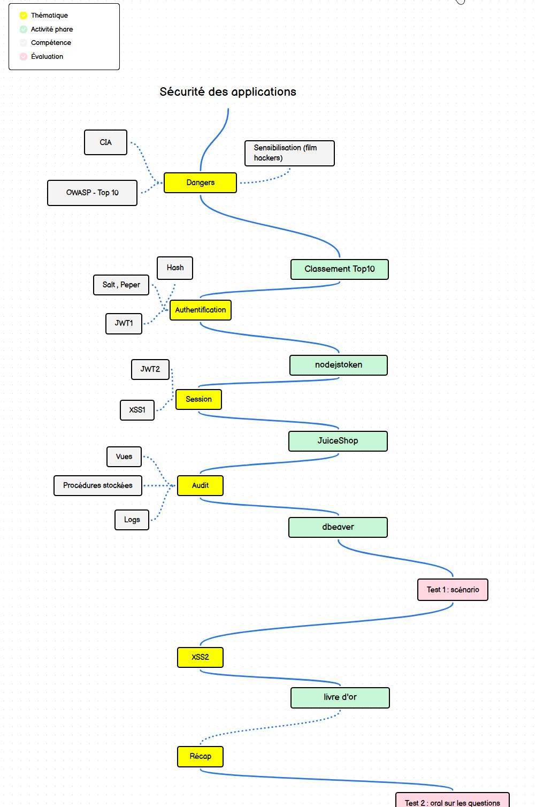
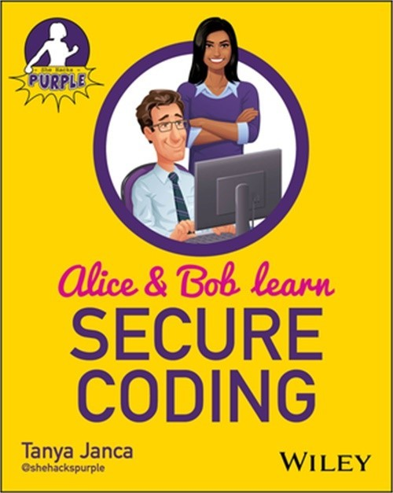

# ICT-183 Implémenter la sécurité des applications

Parcours des problématiques usuelles en sécurité applicative en suivant les guide CIA et OWASP...

## Cadre du module
- [Définition du module 183 selon ICT](legal/183_3_Implémenter la sécurité d'une application.pdf)
- [Directive d'évaluation de prestations](legal/183-DEP.docx)

## Roadmap

### Évaluation
1. Test écrit sur  un scénario fictif [50%]
  - identifier / classer les risques
  - proposer des contre-mesures adaptées
  
2. Test oral sur 40 questions connues à l’avance [50%]

## [Séquences](sequences/)

## Lecture recommandée

